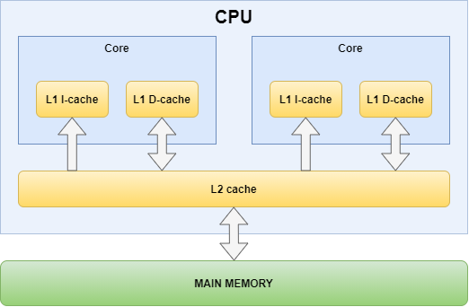

#cache #GPU 

CPU和GPU中的缓存有什么区别？

在CPU中缓存以什么样的形式实现的？
硬件、软件上
高速存储单元、cache line缓存行，大小在几十到数百KB之间

内存事务以cache line为单位

缓存的意义是什么？
提高重复访问相同数据的性能

GPU中的缓存相比CPU，需要为数以千记的线程提供数据读写，CPU通常只需要处理几十个线程。

通常，核内缓存是核私有的，下一级为核间共享的

